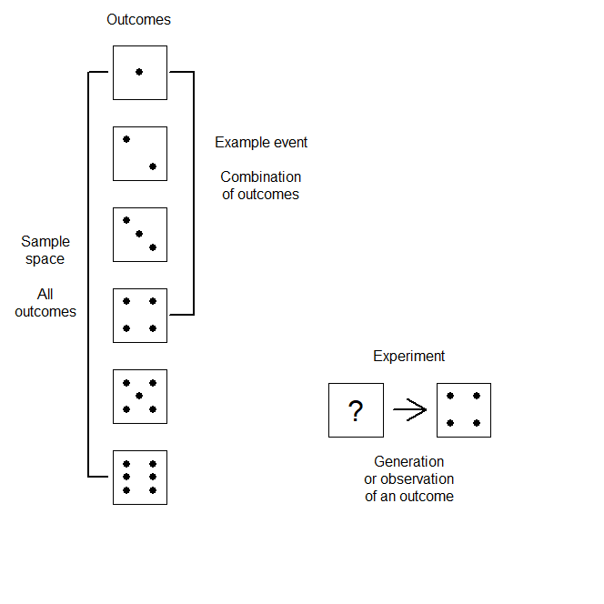
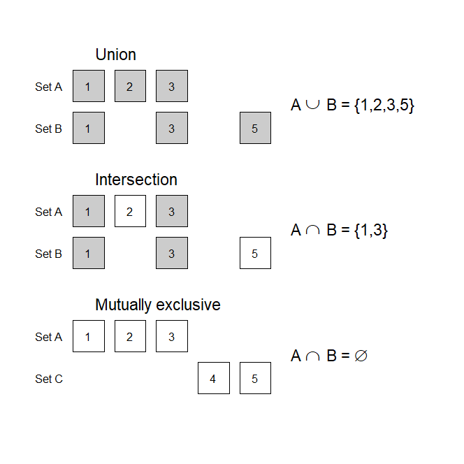

## Probability

A core foundation of statistics is probability. To make inferences about a large group based on a smaller sample, or to predict future events, or to weigh how much the evidence from messy data supports a theory, we rely on probability. This sections provides a brief summary of concepts, notation, and rules that form an important foundation for statistical testing.

<a name="TOC"></a>
### Table of contents

1. <a href="#S01">Random variables and outcomes</a>
    1. <a href="#S01_P01">Basic definitions</a>
    2. <a href="#S01_P02">Notation from set theory</a>
    3. <a href="#S01_P03">Types of random variables</a>
2. <a href="#S02_P01">Probability</a>
    1. <a href="#S02_P01">Probability axioms</a>
    2. <a href="#S02_P02">Notation with random variables</a>
    3. <a href="#S02_P03">Types of probability</a>

<a name="S01"></a>
#### 1. Random variables and outcomes

<a name="S01_P01"></a>
#### 1.1. Basic definitions

* **Random variable**: A variable that can randomly take on one of several possible numeric values.
* **Outcome**: The observed value for a random variable.
* **Sample space**: The list of all possible outcomes.
* **Event**: A collection of outcomes, a subset of the sample space. A event can consist of a single outcome, or multiple outcomes. Furthermore, the same outcome can appear in different events.
* **Experiment**: An opportunity to observe a outcome or event.

Consider the result of rolling a numbered six-sided die. This is a random variable, as the numbered side that ends up facing upward can be any value between 1 to 6, and can change each time you roll the die. The upward-facing number is an outcome, and the values 1 through 6 are the sample space, as this describes all possible outcomes. This sample space can be divided into many different possible events, from singular outcomes (1, 2, 3, etc.), to combinations ( 1 or 2, 1 or 3, 2 or 3, etc.). The act of rolling the die and observing a which value ends up facing upwards is an experiment.



<a href="#TOC">Table of contents</a>

<a name="S01_P02"></a>
#### 1.2. Notation from set theory

When discussing sample spaces, outcomes, and events, one turns to **set theory**. The logic and language of set theory can get complicated quickly, but it is worth remembering some key notation.

* If all elements of a set A are included in a different set B, we can represent this as A &isin; B (A is an **element** of B).
    * Consider the sample space &Omega; = {1,2,3,4} and the events A = {1,2} and B = {1,2,3}. Then A &isin; &Omega;, B &isin; &Omega;, and A &isin; B.
* If no elements of a set A are in another set B, we can represent this as A &notin; B.
* We can use &empty; to refer to the **empty set** (i.e., no elements or outcomes).
* If we want to consider the set of elements that are either 1) in event A, 2) in event B, or 3) in both A and B, we can represent this set of elements as A &cup; B (The **union** of A and B).
    * For the events A = {1,3,5}, B = {1.2,3}, A &cup; B then refers to the elements 1, 2, 3, and 5.
* If we want to consider only the elements that are part of both event A and event B, we can represent this as A &cap; B (the **intersection** of A and B).
    * For the events A = {1,3,5}, B = {1.2,3}, A &cap; B then refers to only the elements 1, and 3.
* The set A and the set B are **mutually exclusive** if no elements of A are in B; in other words, the intersetion of A and B is the empty set, A &cap; B = &empty;.



<a href="#TOC">Table of contents</a>

<a name="S01_P03"></a>
#### 1.3. Types of random variables

Random variables can be further categorized as:

* **Discrete**: A random variable that takes on a countable number of distinct values.
* **Continuous**: A random variable that can take on an infinite number of values.

Rolling a six-sided die is an example of a discrete random variable, as only six distinct values are possible. In contrast, the resulting decimal value for the angle of the arrow for a spinner/picker wheel is an example of a continuous variable.

*Note: The concepts of discrete versus continuous random variables are more malleable than they may first seem. For example, it is possible to have a discrete random variable that in theory can take on an infinite number of integer values (i.e., being countably infinite). Furthermore, what we often label as continuous random variables in reality are discrete variables with a very large sample space (e.g., if we measure people who can range between 1 and 2 meters in height with a ruler to reads accurately to a millimeter, technically we have a discrete random variable with a set of 1,001 possible outcomes). In reality, we cannot measure anything with infinite precision!*

<a href="#TOC">Table of contents</a>

<a name="S02"></a>
#### 2. Probability

<a name="S02_P01"></a>
#### 2.1. Probability axioms

To properly describe a random variable, we turn to probability. Probability is a special type of function, assigning numbers to outcomes and events in a sample space that satisfy a set of rules, known as the **probability axioms**. We can call the output of the function P(X) a probability if:

1. The value for P(X) lies between 0 and 1; 0 &geq; P(X) &leq; 1.
2. The likelihood that at least one of the outcomes in the sample space &Omega; (of which the event X is a subset) will occur equals 1; P(&Omega;) = 1.
3. If events X and Y are mutually exclusive (outcomes in X do not overlap with outcomes in Y), then the likelihood that either X or Y will occur equals the sum of the individual likelihoods for X and Y; Given X &notin; Y, P(X %cup; Y) = P(X) + P(Y).

<a name="S02_P02"></a>
#### 2.2. Notation with random variables

The typical notation for a random variable is a boldface capital letter, like **X** or **Y**. A distinction is made between a random variable and its observed value, the latter of which is represented by standard lower-case letters like x or y. So we can write:

**X** = x,

which simply means the observed value for the random variable **X** is x. Combining this with the notation for probability, we can then represent the probabiliy that the random variable **X** will equal the observed value x as:

P(**X** = x).

Additionally, we can combine this with inequalities. So we can write:

P(**X** &leq; x),

which denotes the probability that a random variable will be less than or equal to an observed value x.

<a href="#TOC">Table of contents</a>

<a name="S02_P03"></a>
#### 2.3. Types of probability

While the probability axioms lay out the rules that determine what constitutes a valid probability, this does not solve *how to interpret probabilities*. What does it mean for P(**X** = x) = 0.1? One straightforward way to think of probability is that it is the ratio of the actual number of occurences divided by the total number of possible occurences. However, there are a few different ways to assign probabilities to outcomes, typically divided into three types:

1. **Classical** probability.

This type of probability assumes that outcomes are equally probable, and assigns probabilities as the ratio of the number of specified outcomes over the number of outcomes in the sample space. We can again use the fair six-sided die as an example of this type of probability. There are six possible outcomes, so each outcome has a 1 in 6 chance of occurring.

This type of probability is intuitive and easy to work with, but of course hinges on equally probable outcomes, which does not have to be the case. For example, a dice with some of the corners rounded is not fair - the rounded corners make it harder for some numbers to end up facing upward.

2. **Frequentist** or **empirical** probability.

This type of probability is based on the number of times a outcome (or event) occurs with repeated (independent) experiments. The classic example for this type of probability is flipping a coin. If you want to know the probability that a coin will come up heads when flipped, you can flip the coin repeatedly and count the number times it comes up heads, divided by the number of times you flipped the coin. This will give you an estimate of the probability of the coin coming up heads.

Frequentist probability has been a mainstay of statistics for a long time. There are nuances to how it is used though, that can be non-intuitive.

* Frequentist probability is built around *asymptotic behavior*. Consider the coin flip. The more you flip the coin, the better your estimate of the probability that it will come up heads will be, and if you fipped this coin an infinite number of times, then you would obtain the actual probability. The nuance here is that the probability is based on a thought experiment, as we could never actually flip the coin an infinite number of times.
* Frequentist probability is only valid for a *repeatable* event. Flipping a coin is clearly something that can be easily repeated. However, other types of events once again often require thought experiments. Conducting a complicated scientific study is typically difficult to replicate many times. So again, one must instead *imagine* the possible outcomes that could result from repeating the study many times, rather than actually repeating the study. However, some events are not repeatable. For instance, if a doctor wants to know the probability that their current patient has a specific illness, this type of event is too specific for frequentist probability.

3. **Subjective** or **evidential** probability.

This type of probability gives the measure of an individual person's belief that an event will happen. In other words, a person can assign values to whether events will occur (e.g., I there's a 80% chance it will rain tomorrow), and as long as they meet the requiremets based on the three axioms of probability, you have a valid subjective probablity.

This type of probability is part of the basis for Bayesian statistics, which has gain popularity in recent years. However, the fact that different individuals can assign different probabilities to events unnerves many people. Furthermore, it can be hard to convert an individual's beliefs into valid probabilities.

*Note: These types of probabilities overlap - they are not mutually exclusive!*

<a href="#TOC">Table of contents</a>

```R
# Example R code
```

*Note: Advanced content.*

[Return to sections](C00_P002_Chapters.md)


