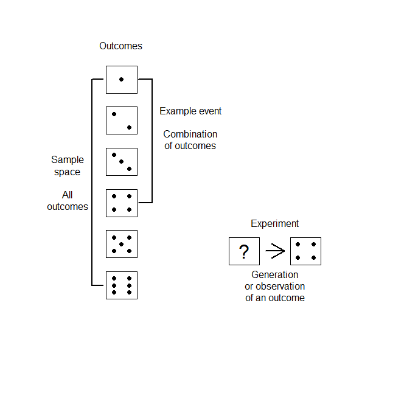
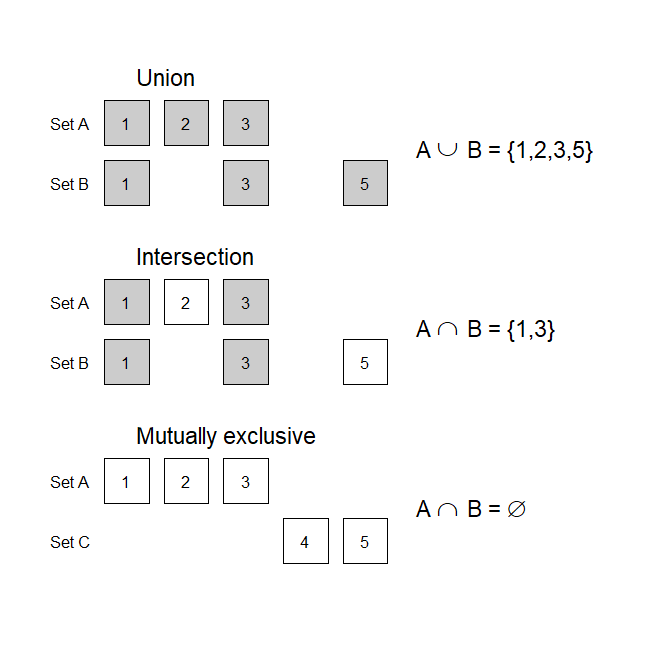

<script src="https://cdn.mathjax.org/mathjax/latest/MathJax.js?config=TeX-AMS-MML_HTMLorMML" type="text/javascript"></script>
## Set theory

Statistics relies extensively on probability theory. In turn, probability theory relies heavily upon set theory; an understanding of probability therefore requires knowledge of several key concepts from set theory.

<a name="TOC"></a>
### Table of contents
1. <a href="#S01">Experiments, sample spaces, and events</a>
2. <a href="#S02">Set theory</a>
3. <a href="#S03">Elementary set operations</a>
4. <a href="#S04">Examples in R</a>

<a href="#END">&#129147;</a>

<a name="S01"></a>
#### 1. Experiments, sample spaces, and events

* **Experiment**: Any process (real or hypothetical) in which the possible outcomes can be identified ahead of time.
* **Sample space** or **population**: The set of all possible outcomes that could occur.
* **Event**: Any collection of possible outcomes in the experiment; any subset of the sample space.

Consider the result of rolling a numbered six-sided die. The act of rolling the die is an **experiment**; the value on the side of the die facing upward is an **outcome**, and the set of outcoms of observing either the sides labeled 1, 2, 3, or 4 facing upward, respectively, is an example of an **event**:



*Note: The definition of an experiment is intentionally flexible, allowing almost any process to be labeled as an experiment.*

##### References:

* Luce, R. D. (1986). *Response times: Their role in inferring elementary mental organization*. Oxford University Press. [&rarr;](https://oxford.universitypressscholarship.com/view/10.1093/acprof:oso/9780195070019.001.0001/acprof-9780195070019)

<a href="#TOC">&#129145;</a> <a href="#END">&#129147;</a>

<a name="S02"></a>
#### 2. Set theory

Set theory provides a formal mathematical way of describing a collection of elements, thereby providing a rigorous framework to characterize the possible outcomes of an experiment.

* **Set**: A collection of objects (called **elements** or **members**) regarded as a single object.
     * The sides of a die (1 to 6) are an example of a set
     * A specific side (i.e., the side labeled "1") is an element/member of the set

Consider the set &Omega; = \{ 1, 2, 3, 4, 5, 6 \}. There are several **operators** we can use to indicate whether elements are in a set or not:
* 1 &isin; &Omega; - the number 1 is an element of the the set &Omega;.
* 7 &notin; &Omega; - the number 7 is not an element of the the set &Omega;.
* \{ 1, 3, 5 \} &sub; &Omega; - the set of numbers 1, 3, and 5 form a **subset** of the larger set &Omega;.
* \{ 1, 2, 3, 4, 5, 6 \} &#8838; &Omega; - the set of numbers from 1 to 6 are a subset of or equal to the set &Omega;.

There are several special sets worthy of note:
* The **empty set**, or &empty; - a set with no elments or members (the empty set is any event that cannot occur).
* **Real numbers**, or &#8477; - the set of all rational or irrational (e.g., ) numbers, either positive, negative, or zero.
* **Natural numbers**, or &#8469; - the set of whole numbers (either starting from 0 or 1, depending on the field).
* **Integers**, or &#8484; - the set with whole numbers, negative whole numbers, and zero.

Sets can be categorized as being...
* **Finite**; sets with a finite number of elements.
* **Infinite**; sets with an infinite number of elements. Furthermore, an infinite set can be:
  * **Countable** (when there is a one-to-one correspondence between elements of the set and the set of natural numbers &#8469;).
  * **Uncountable** (sets that are neither finite nor countable).

The sample space, then, is a type of set, and an event is any subset of the sample space, allowing us to use all of the tools of set theory to describe the outcomes for the experiment of interest.

##### References:

* DeGroot, M. H., & Schervish, M. J. (2012). *Probability and statistics* (4th ed.). Boston, MA: Addison-Wesley. [&rarr;](https://www.pearson.com/us/higher-education/product/De-Groot-Probability-and-Statistics-4th-Edition/9780321500465.html)

<a href="#TOC">&#129145;</a> <a href="#END">&#129147;</a>

<a name="S03"></a>
#### 3. Elementary set operations

Three key operations that allow us to describe how sets do or don't overlap are:
* The **complement** of a set:
     * All elements not in a set
     * Written as A' or A<sup>c</sup>
* The **union** of two sets:
     * For sets A and B, their union refers to the set of elements contained in either A or B, irrespective of overlap
     * Written as A &cup; B
* The **intersection** of two sets:
     * For sets A and B, their intersection refers to the set of elements contained in both A or B, only overlapping elements
     * Written as A &cap; B

Furthermore, sets A and B are **mutually exclusive** or **disjoint** when no elements in either set overlap; A &cap; B = &empty;.



<a name="S03_R01"></a>
With care, one can treat set operations in a similar manner to addition or multiplication. For example, given any three events, A, B, and C, which are subsets of sample space &Omega;, we have:
* **Commutativity**:
     * A &cup; B = B &cup; A
     * A &cap; B = B &cap; A
* **Associativity**:
     * A &cup; (B &cup; C) = (A &cup; B) &cup; C
     * A &cap; (B &cap; C) = (A &cap; B) &cap; C
* **Distributive Laws**:
     * A &cap; (B &cup; C) = (A &cap; B) &cup; (A &cap; C)
     * A &cup; (B &cap; C) = (A &cup; B) &cap; (A &cup; C)
* **DeMorgan's Laws**:
     * (A &cup; B)<sup>c</sup> = A<sup>c</sup> &cap; B<sup>c</sup>
     * (A &cap; B)<sup>c</sup> = A<sup>c</sup> &cup; B<sup>c</sup>

The operations of union and intersection can be extended to infinite collections of sets. Let E<sub>1</sub>, E<sub>2</sub>, E<sub>3</sub>, ... be a collection of sets defined on a sample space &Omega; - then...

$$
\cup_{i=1}^{\infty} E_i = x.
$$


$$
\cap_{i=1}^{\infty} E_i = x.
$$

##### References:

* Casella, G., & Berger, R. L. (2002). *Statistical inference* (2nd ed.). Pacific Grove, CA: Thomson Learning. [&rarr;](https://www.books-by-isbn.com/0-534/0534243126-Statistical-Inference-George-Casella-Roger-L.-Berger-0-534-24312-6.html)

<a name="S04"></a>
#### 4. Examples in R

```R
# Example sample space
S <- c( 1, 2, 3, 4, 5 )
# Subsets/Events
A <- c( 1, 2, 3 )
B <- c( 1, 3, 5 )

# Test if element is in set
is.element( 1, S ) # Returns: TRUE
is.element( 6, S ) # Returns: FALSE

# Elementary set operations
union( A, B ) # Returns: 1 2 3 5
intersect( A, B ) # Returns: 1 3
# Complement of A
setdiff( S, A ) # Returns: 4 5 6
# Complement of B
setdiff( S, B ) # Returns: 2 4 6
```

<a href="#TOC">&#129145;</a>

##### Coming soon
* Definition of pairwise disjoint
* Union/intersection over sequence of subsets

<a name="END"></a>
Return to:
[Probability](C01_P000_Probability.md);
[Sections](C00_P002_Chapters.md);
[Index](I0_P000_Main_index.md ); 
[Home page](https://rettopnivek.github.io/Tutorials_for_statistics/)
